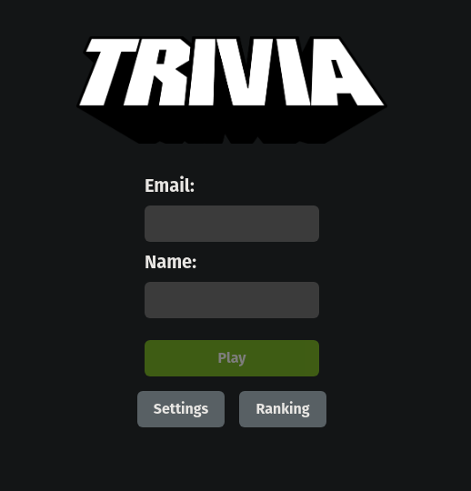
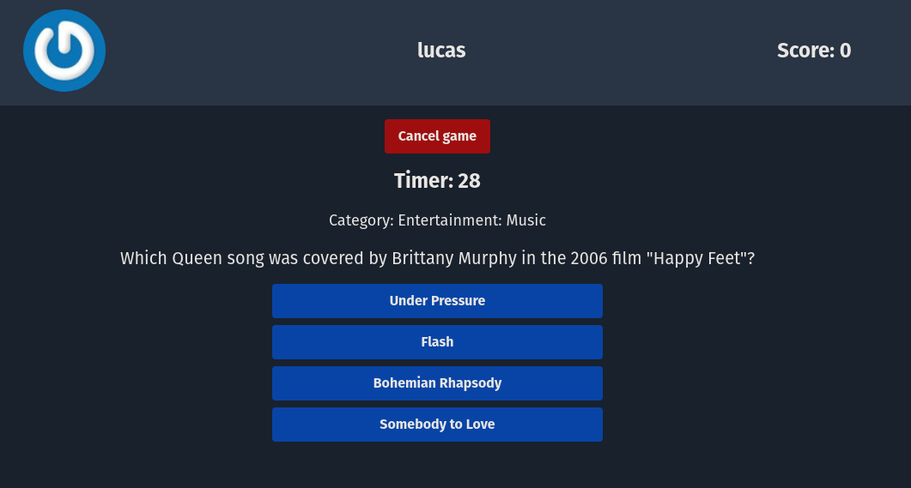
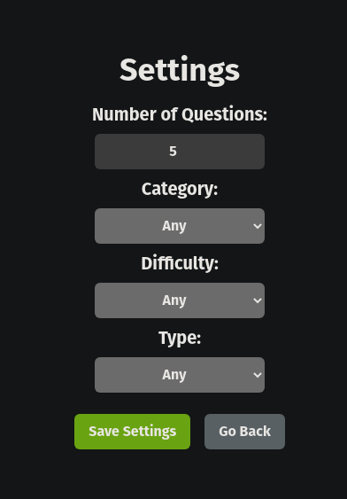

# React Trivia

---

> A question and answer game, made with _React and Redux_.

- Made by [Lucas Ximenes](https://www.linkedin.com/in/lucasdximenes/)
- [Demo](https://react-trivia-orcin.vercel.app/)

- [English](README.md)
- [Portuguese](README_pt-br.md)

- In this application you can:

  - Log into the game and, if the email is registered on the [Gravatar] website (https://pt.gravatar.com/), have your photo associated with the user's profile.
  - Access the page referring to the game, where you must choose one of the answers available for each of the questions presented. The answer must be marked before the timer reaches zero, otherwise the answer will be considered wrong.
  - Be redirected, after 5 questions answered, to the score screen, where the text shown depends on the number of hits.
  - View the ranking page, if you like, at the end of each game.
  - Configure some options for the game in a configuration screen accessible from the app header.

- The application was developed in order to practice the concepts of _React_ and _Redux_.

- The application uses the API of [Open Trivia Database](https://opentdb.com/), which provides a database of multiple choice questions and answers, of various categories and difficulties.

---

## How to run the application

- Clone the repository
- Install dependencies with `npm install`
- Start the development server with `npm start`
- Access `http://localhost:3000/` in your browser

## How to run the tests

- After cloning the repository and installing the dependencies, run `npm test`

---

## Acquired knowledge

- _React_

  - _React Router_
  - _Redux_

- _Tests_

  - _Jest_
  - _React Testing Library_

- _CSS_

  - _Tailwind CSS_

- _Use of APIs_

- _Agile development_
  - _Git_
  - _GitHub_
  - _Scrum_
  - _Trello_

---

## Technologies used

- [React](https://reactjs.org/)
- [Redux](https://redux.js.org/)
- [React Router](https://reactrouter.com/)
- [React Testing Library](https://testing-library.com/docs/react-testing-library/intro/)
- [Jest](https://jestjs.io/)
- [Tailwind CSS](https://tailwindcss.com/)
- [Gravatar](https://pt.gravatar.com/)
- [Open Trivia Database](https://opentdb.com/)
- [Vercel](https://vercel.com/)

---

## Preview

---
