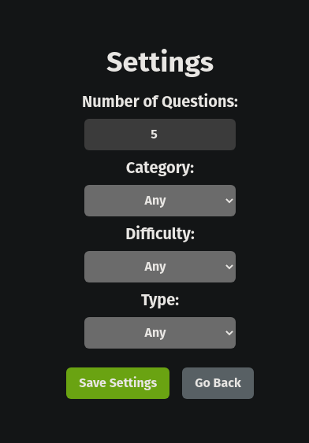

# React Trivia

---

> Um jogo de perguntas e respostas, feito com _React e Redux_.

- Feito por [Lucas Ximenes](https://www.linkedin.com/in/lucasdximenes/)
- [Demo](https://react-trivia-orcin.vercel.app/)

- [English](README.md)
- [Português](README_pt-br.md)

- Nessa aplicação você poderá:

  - Logar no jogo e, se o email tiver cadastro no site [Gravatar](https://pt.gravatar.com/), ter sua foto associada ao perfil da pessoa usuária.
  - Acessar a página referente ao jogo, onde se deverá escolher uma das respostas disponíveis para cada uma das perguntas apresentadas. A resposta deve ser marcada antes do contador de tempo chegar a zero, caso contrário a resposta deverá ser considerada errada.
  - Ser redirecionada, após 5 perguntas respondidas, para a tela de score, onde o texto mostrado depende do número de acertos.
  - Visualizar a página de ranking, se quiser, ao final de cada jogo.
  - Configurar algumas opções para o jogo em uma tela de configuração acessível a partir do cabeçalho do app.

- A aplicação foi desenvolvida com o objetivo de praticar os conceitos de _React_ e _Redux_.

- A aplicação utiliza a API do [Open Trivia Database](https://opentdb.com/), que fornece um banco de dados de perguntas e respostas de múltipla escolha, de diversas categorias e dificuldades.

---

## Como rodar a aplicação

- Clone o repositório
- Instale as dependências com `npm install`
- Inicie o servidor de desenvolvimento com `npm start`
- Acesse `http://localhost:3000/` no seu navegador

## Como rodar os testes

- Após clonar o repositório e instalar as dependências, execute `npm test`

---

## Conhecimentos adquiridos

- _React_

  - _React Router_
  - _Redux_

- _Testes_

  - _Jest_
  - _React Testing Library_

- _CSS_

  - _Tailwind CSS_

- _Uso de APIs_

- _Desenvolvimento ágil_
  - _Git_
  - _GitHub_
  - _Scrum_
  - _Trello_

---

## Tecnologias utilizadas

- [React](https://reactjs.org/)
- [Redux](https://redux.js.org/)
- [React Router](https://reactrouter.com/)
- [React Testing Library](https://testing-library.com/docs/react-testing-library/intro/)
- [Jest](https://jestjs.io/)
- [Tailwind CSS](https://tailwindcss.com/)
- [Gravatar](https://pt.gravatar.com/)
- [Open Trivia Database](https://opentdb.com/)
- [Vercel](https://vercel.com/)

---

## Preview

---
